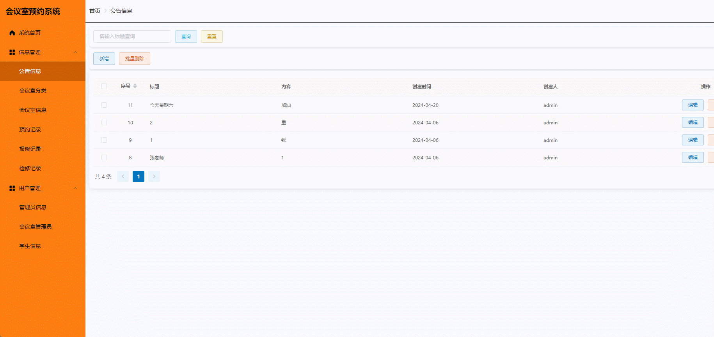
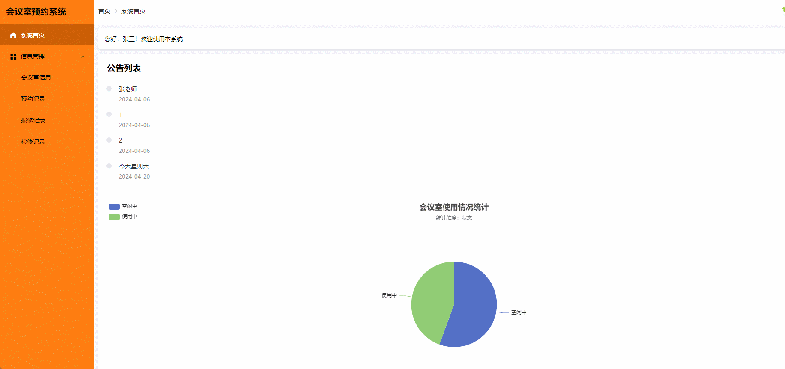

#  meeting-room-reservation🎂

基于Springboot+Vue的会议室预约系统

## 介绍🌞

> 鉴于高校会议室在人工预约过程中存在的利用率低下与管理不足的问题，同时为了积极响应师生对高效利用会议室资源的需求，我们精心设计了一套基于SpringBoot与Vue技术的会议室预约系统。该系统采用先进的前后端分离架构，旨在通过技术手段优化会议室的预约与管理流程。

## 软件架构

系统核心由三大角色板块构成：系统管理员、会议室管理员以及学生用户。每个角色都承担着特定的职责与功能，共同推动会议室的高效运作。


## 项目演示🌞

> 管理员和会议室管理员的界面大致相同，只是对有些界面的权限不同



> 学生界面



## 安装教程🌞

```
1. 运行环境准备mysql8 + java8 + node14.16.1

2. 配置maven路径，加载依赖

3. 运行sql文件，确保application.yml或config.properties的数据库名称和账号密码是数据库所在主机的账号密码
```


## 使用说明🌞

```
1. 登入

      	管理员账号：admin 密码：123456

        会议室管理员账号：teacher 密码：123456

        学生账号：student 密码：123456
  
2. 运行流程

SpringBoot+Vue项目的部署详情可以查看这篇CSDN博客：http://t.csdnimg.cn/kpuxS

前后端不分离项目的部署流程可以查看这篇CSDN博客：http://t.csdnimg.cn/CslA5
```


## CSDN项目合集🌞

点击前往：http://t.csdnimg.cn/Q4u84


## 联系我🌞

**有偿获取完整源码或调试代码**

🐧：1902317191

微信：


